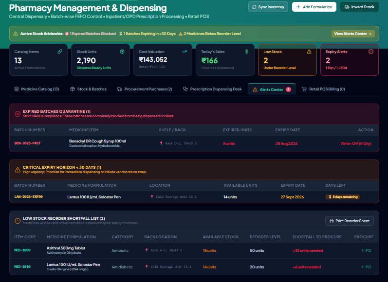
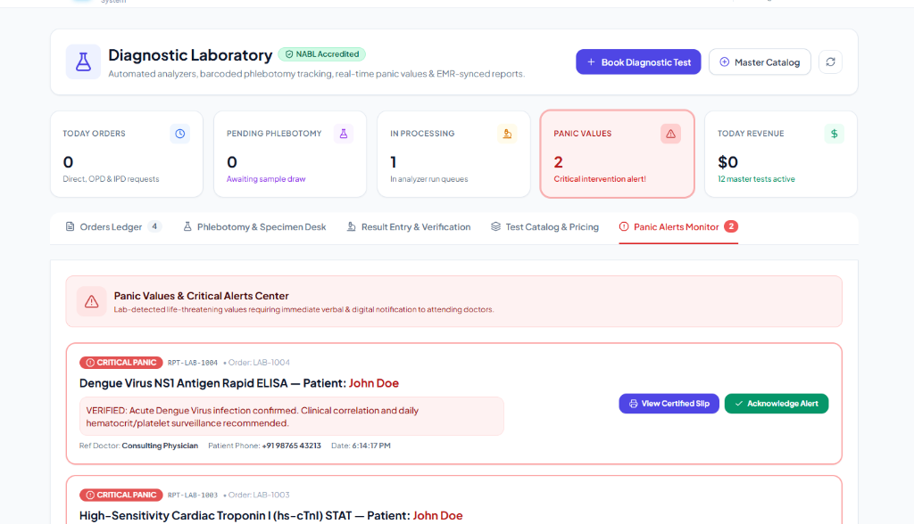
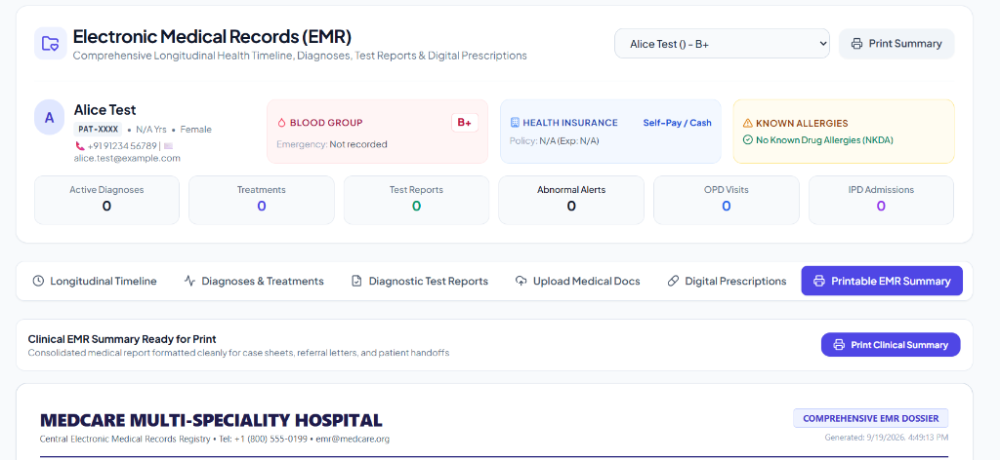
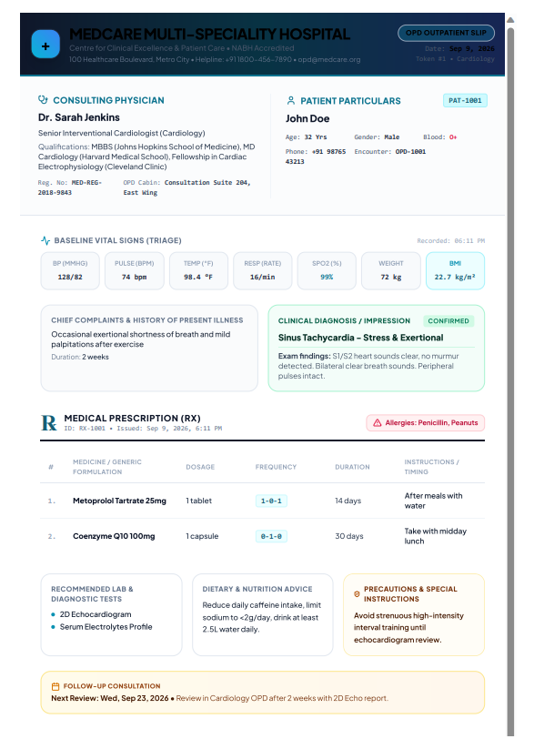
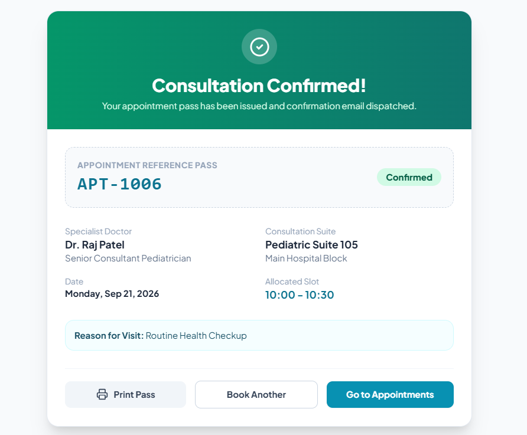
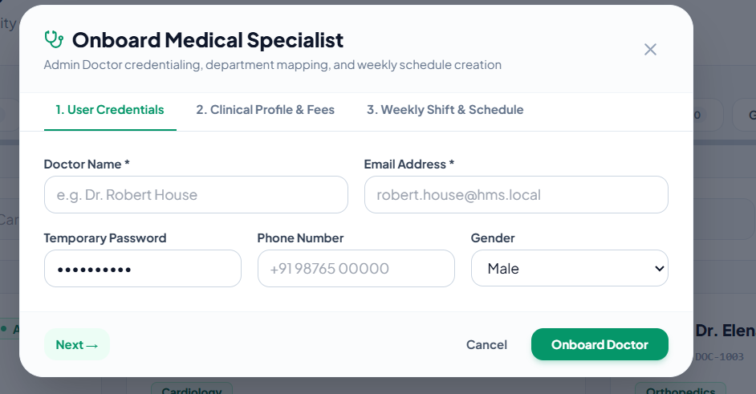

# 🏥 MedCare — Enterprise Hospital Management & Clinical Information System (HMIS)

<div align="center">


**A Cloud-Ready, Comprehensive Full-Stack Healthcare Management & EMR Platform**  
*Engineered with a 6-Role RBAC Matrix, JWT Security, FEFO Pharmacy Dispensing, Barcoded Diagnostics, Real-Time OPD/IPD Bed Matrix, and NABH-Compliant Printable Slips.*

<br />

**Developed with ❤️ by [Chandan Mourya](https://github.com/)**

</div>

---

## 📑 Table of Contents
- [📸 Visual Showcase & Demo Gallery](#-visual-showcase--demo-gallery)
- [🌟 Core System Architecture & Features](#-core-system-architecture--features)
- [🔐 6-Tier Role-Based Access Control (RBAC)](#-6-tier-role-based-access-control-rbac)
- [🔑 Pre-Configured Demo / Viva Accounts](#-pre-configured-demo--viva-accounts)
- [🚀 Quick Start & Installation Guide](#-quick-start--installation-guide)
- [📡 REST API Endpoints Reference](#-rest-api-endpoints-reference)
- [🛡️ Security Architecture & Clinical Integrity](#️-security-architecture--clinical-integrity)
- [📂 Project Directory Structure](#-project-directory-structure)
- [👨‍💻 Author & Acknowledgements](#-author--acknowledgements)

---

## 📸 Visual Showcase & Demo Gallery

### 1. 💊 Central Pharmacy Management & FEFO Dispensing Desk
Batch-wise expiry control, automated First-Expired First-Out (FEFO) allocation, real-time quarantine alerts, and retail POS counter checkout.

<div align="center">
  
</div>

<br />

### 2. 🔬 Diagnostic Laboratory & Critical Panic Values Center
Master test catalog, automated reference interval evaluation (Normal/Low/High/Critical), panic alert notification center, and NABL-format verification.

<div align="center">
  
</div>

<br />

### 3. 📁 Electronic Medical Records (EMR) Longitudinal Timeline
Consolidated patient clinical dossier: diagnoses, surgical history, allergy tags, test reports, and print-ready clinical summaries.

<div align="center">
  
</div>

<br />

### 4. 🩺 NABH Outpatient Digital Prescription Slip (`RX-1001`)
Clean, printable prescription slips (`@media print` formatted) with hospital letterhead, doctor credentials, vital signs, medication regimens, and dietary advice.

<div align="center">
  
</div>

<br />

### 5. 📅 Online Consultation Pass & Specialist Credentialing
Multi-step appointment scheduling with atomic conflict checks, downloadable consultation passes, and admin doctor credentialing intake.

| 📅 Appointment Consultation Pass (`APT-1006`) | 👨‍⚕️ Specialist Onboarding Wizard |
| :---: | :---: |
|  |  |

---

## 🌟 Core System Architecture & Features

### 👑 1. Super Admin Console & Staff Governance
- **Multi-Role Staff Provisioning:** Onboard Doctors, Pharmacists, Lab Techs, Receptionists, and Admins with custom credentials.
- **Instant Auto-Verification:** Staff created by the Administrator are auto-verified (`isVerified: true`) to bypass email bottlenecks and ensure clinical continuity.
- **Soft Deactivation (Power ⏻):** Immediately revokes login privileges without destroying historical prescriptions or medical records.
- **Permanent Removal (Trash 🗑):** Purges staff records from MongoDB while cascading linked clinical profiles.
- **Self-Protection Guard:** Super Admin cannot delete or deactivate their own active session to prevent accidental lockouts.

### 🩺 2. OPD (Outpatient Department) Engine
- **Walk-in Triage & Vitals:** Front-desk check-in capturing BP, Heart Rate, Temperature, SpO2, Respiratory Rate, Weight, Height, and auto-calculated BMI.
- **Queue & Token Engine:** Daily resetting queue tokens (`Token #1, #2...`) per doctor.
- **Doctor Consultation Desk:** Chief complaints intake, allergy safety alert banners (Penicillin, Latex, etc.), multi-medication prescription builder (`1-0-1` frequency), and automatic EMR synchronization.

### 🛏️ 3. IPD (Inpatient Department) & Bed Matrix
- **Interactive Bed Matrix:** Visual real-time ward grid across General, Semi-Private, Private, ICU, and Emergency with live occupancy percentages.
- **Bed Status Lifecycle:** Available (Green) &rarr; Occupied (Rose) &rarr; Bed Transfer &rarr; Sanitization / Cleaning (Amber).
- **Clinical Progress Rounds:** Daily physician condition notes (`Stable`, `Guarded`, `Critical`) and inpatient medication orders.
- **Discharge Clearance:** Automated length-of-stay day billing calculation and printable discharge summaries.

### 💊 4. Pharmacy & FEFO Inventory
- **FEFO Dispensing (First-Expired, First-Out):** Automatically allocates batches with earliest expiry dates first; strictly blocks expired batches.
- **Real-Time Stock Alerts:** Low-stock threshold alerts, critical expiry (<30 days) notices, and 1-click printable supplier reorder sheets.
- **Point-of-Sale (POS):** Retail walk-in counter checkout with GST tax calculations and printable tax invoices (`PHARM-xxxx`).

### 🔬 5. Diagnostic Laboratory & Panic Values
- **Test Master Catalog:** Standard formulations across Biochemistry, Hematology, Serology, Pathology, and Endocrinology.
- **Phlebotomy Accessioning:** Barcode tracking (`SMP-xxxx`) with specimen quality checks (`Good`, `Hemolyzed`, `Lipemic`, `Clotted`).
- **Real-Time Flagging:** Auto-evaluates findings against biological reference intervals: `Normal`, `Low`, `High`, and `Critical Panic`.

---

## 🔐 6-Tier Role-Based Access Control (RBAC)

The platform enforces zero-trust authorization at both the **Express API layer** and the **React router layer**:

| Feature / Module | Super Admin | Doctor | Receptionist | Pharmacist | Lab Tech | Patient |
| :--- | :---: | :---: | :---: | :---: | :---: | :---: |
| **System Admin Console (`/admin`)** | 🟢 **Full** | 🔴 403 | 🔴 403 | 🔴 403 | 🔴 403 | 🔴 403 |
| **Staff Lifecycle (`/auth/staff`)** | 🟢 **Full** | 🔴 403 | 🔴 403 | 🔴 403 | 🔴 403 | 🔴 403 |
| **Doctor Consultation Desk (`/doctor`)** | 🟢 Full | 🟢 **Full** | 🔴 403 | 🔴 403 | 🔴 403 | 🔴 403 |
| **OPD Walk-in Triage (`/opd/register`)** | 🟢 Full | 🔴 403 | 🟢 **Full** | 🔴 403 | 🔴 403 | 🔴 403 |
| **Pharmacy Dispensing & POS (`/pharmacy`)** | 🟢 Full | 🟡 Read | 🟡 Read | 🟢 **Full** | 🔴 403 | 🔴 403 |
| **Lab Diagnostics & Panic Desk (`/lab`)** | 🟢 Full | 🟡 Read | 🟡 Read | 🔴 403 | 🟢 **Full** | 🔴 403 |
| **Longitudinal EMR Timeline (`/emr`)** | 🟢 Full | 🟢 Full | 🟢 Full | 🔴 403 | 🔴 403 | 🔵 Self Only |
| **Patient Portal (`/patient`)** | 🟢 Full | 🔴 403 | 🔴 403 | 🔴 403 | 🔴 403 | 🟢 **Self** |

---

## 🔑 Pre-Configured Demo / Viva Accounts

The database seeder provisions ready-to-test accounts across all 6 roles:

| Role | Email | Password | Role Description / Specialty |
| :--- | :--- | :--- | :--- |
| **👑 Super Admin** | `admin@hms.local` | `Admin@123` | System Administrator & Hospital Governance |
| **🩺 Doctor 1** | `doctor@hms.local` | `Doctor@123` | `DOC-1001` (Cardiology, Mon–Fri, Room 204) |
| **🧠 Doctor 2** | `marcus.vance@hms.local` | `Doctor@123` | `DOC-1002` (Neurology, Mon/Wed/Fri, Room 310) |
| **📋 Receptionist** | `receptionist@hms.local` | `Receptionist@123` | Front Desk, OPD Registration & Bed Admissions |
| **💊 Pharmacist** | `pharmacist@hms.local` | `Pharmacist@123` | `Alex Chen, RPh` (Central Pharmacy & Dispensary) |
| **🔬 Lab Tech** | `labtech@hms.local` | `Labtech@123` | `Dr. Robert Taylor, MD Pathologist` (Lab Director) |
| **🧑‍🦱 Patient 1** | `patient@hms.local` | `Patient@123` | `PAT-1001` (O+, Asthma, Penicillin [Severe]) |
| **👩 Patient 2** | `emily.clark@hms.local` | `Patient@123` | `PAT-1002` (A+, Hypertension, Latex [Mild]) |

> **Viva Pro-Tip:** The login screen includes **1-Click Quick Demo Login Buttons** that auto-fill credentials for presentations without typing!

---

## 🚀 Quick Start & Installation Guide

### 1. Prerequisites
- **Node.js**: v18.0 or higher
- **MongoDB**: Community Server running locally on port `27017` (or MongoDB Atlas URI)
- **Git**

---

### 2. Clone the Repository
```bash
git clone https://github.com/your-username/hospital-management-system.git
cd hospital-management-system
```

---

### 3. Backend Setup
```bash
# 1. Navigate to backend
cd backend

# 2. Install dependencies
npm install

# 3. Create environment configuration
cp .env.example .env

# 4. Verify your .env variables:
# PORT=5000
# MONGO_URI=mongodb://127.0.0.1:27017/hms_db
# JWT_SECRET=your_jwt_secret_key_minimum_32_chars
# JWT_EXPIRES_IN=7d
# CLIENT_URL=http://localhost:5173

# 5. Seed the database with demo clinical data
npm run seed

# 6. Start backend development server
npm run dev
```
*Backend API will run at **http://localhost:5000***

---

### 4. Frontend Setup
In a new terminal window:
```bash
# 1. Navigate to frontend
cd frontend

# 2. Install dependencies
npm install

# 3. Start Vite frontend server
npm run dev
```
*Frontend application will run at **http://localhost:5173***

---

### 5. Running Automated Verification Tests
```bash
# Run backend test suite (66/66 automated tests)
cd backend
npm test

# Verify production frontend build
cd frontend
npm run build
```

---

## 📡 REST API Endpoints Reference

### Base URL: `/api/v1`

| Module | Method | Endpoint | Access | Function |
| :--- | :---: | :--- | :---: | :--- |
| **Auth** | `POST` | `/auth/register` | Public | Self-registration (Patient) |
| **Auth** | `POST` | `/auth/login` | Public | Authenticate user & return JWT token |
| **Auth** | `GET` | `/auth/me` | Authenticated | Retrieve authenticated user session |
| **Staff** | `GET` | `/auth/staff` | Super Admin | List all clinical staff members |
| **Staff** | `POST` | `/auth/staff` | Super Admin | Onboard and auto-verify staff member |
| **Staff** | `PATCH`| `/auth/staff/:id/status` | Super Admin | Toggle staff active/inactive status |
| **Staff** | `DELETE`| `/auth/staff/:id` | Super Admin | Permanently delete staff member |
| **Patients**| `GET` | `/patients` | Staff / Admin | Search, filter & paginate patients |
| **Patients**| `POST` | `/patients` | Staff / Admin | Walk-in intake & create `PAT-xxxx` |
| **Doctors** | `GET` | `/doctors` | Public | Explore certified specialists list |
| **Doctors** | `POST` | `/doctors` | Super Admin | Onboard doctor & generate `DOC-xxxx` |
| **Appts** | `POST` | `/appointments` | Patient / Staff | Book appointment slot & issue pass |
| **OPD** | `POST` | `/opd/register` | Reception / Admin | Triage walk-in vitals & issue token |
| **OPD** | `POST` | `/opd/visits/:id/consultation`| Doctor / Admin | Complete clinical consult & issue Rx |
| **Pharmacy**| `POST` | `/pharmacy/dispense` | Pharmacist / Admin| Dispense medicines with FEFO allocation |
| **Pharmacy**| `POST` | `/pharmacy/bills` | Pharmacist / Staff| POS walk-in checkout with tax invoice |
| **Lab** | `POST` | `/lab/orders` | Staff / Admin | Book diagnostic test & print barcode |
| **Lab** | `POST` | `/lab/orders/:id/tests/:testId/results` | Lab Tech / Doctor | Enter findings & auto-evaluate panic |

---

## 🛡️ Security Architecture & Clinical Integrity

- **Cryptographic Security:** Salted password hashing with `bcryptjs` (10 rounds) and HMAC SHA-256 JWT tokens.
- **Zero-Trust Middleware:** `protect` validates bearer tokens and active user accounts; `authorize(...roles)` restricts endpoints strictly by role.
- **Self-Protection Safeguard:** Active Super Admins are prevented from deleting or deactivating their own account to avoid orphaned databases.
- **Medical Audit Trail:** Support for soft staff deactivation (`isActive: false`) preserves historical prescription and lab order author records for legal compliance.
- **Protected Environment Variables:** `.gitignore` excludes all `.env` and credential files from Git commits, preventing accidental credential leaks.

---

## 📂 Project Directory Structure

```
HMS/
├── backend/
│   ├── src/
│   │   ├── config/          # Database connection (db.js)
│   │   ├── controllers/     # Business logic (auth, opd, ipd, pharmacy, lab, emr...)
│   │   ├── middleware/      # protect, authorize, validation, error handler
│   │   ├── models/          # Mongoose schemas (User, DoctorProfile, Patient, OPDVisit...)
│   │   ├── routes/          # Express route declarations
│   │   ├── seeders/         # Database seeder (seedData.js)
│   │   └── utils/           # JWT generator, emailer, barcode helpers
│   ├── tests/               # Automated Jest / Supertest test suites
│   ├── .env.example         # Template environment variables
│   └── package.json
│
├── frontend/
│   ├── src/
│   │   ├── components/      # Navbar, Footer, ProtectedRoute, Modals, Print Slips
│   │   ├── context/         # AuthContext (JWT session management)
│   │   ├── pages/           # Portals (Admin, Doctor, Receptionist, Pharmacy, Lab, Patient)
│   │   ├── services/        # Axios API clients (adminService, opdService, labService...)
│   │   ├── App.jsx          # Route definitions with ProtectedRoute guards
│   │   └── main.jsx         # React application entry point
│   ├── tailwind.config.js   # Healthcare UI styling theme
│   ├── vite.config.js       # Vite bundler configuration
│   └── package.json
│
├── docs/
│   └── screenshots/         # Embedded GitHub showcase preview images
├── .gitignore               # Excludes .env, node_modules, dist, logs
└── README.md                # Project documentation & viva guide
```

---

## 👨‍💻 Author & Acknowledgements

**Developed by:** **Chandan Mourya**  
*Final-Year B.Tech Major Project in Computer Science & Engineering*

- **Frontend:** React 18, Tailwind CSS, Lucide Icons, Vite
- **Backend:** Node.js, Express.js, MongoDB, Mongoose ODM
- **Standards:** NABH Digital Slip Guidelines, NABL Laboratory Formatting, HIPAA/EHR 2.0 Architectural Compliance

---

<div align="center">
  <sub>Built with clinical precision, security, and scalability. © MedCare Multi-Speciality Hospital & HMIS.</sub>
</div>
